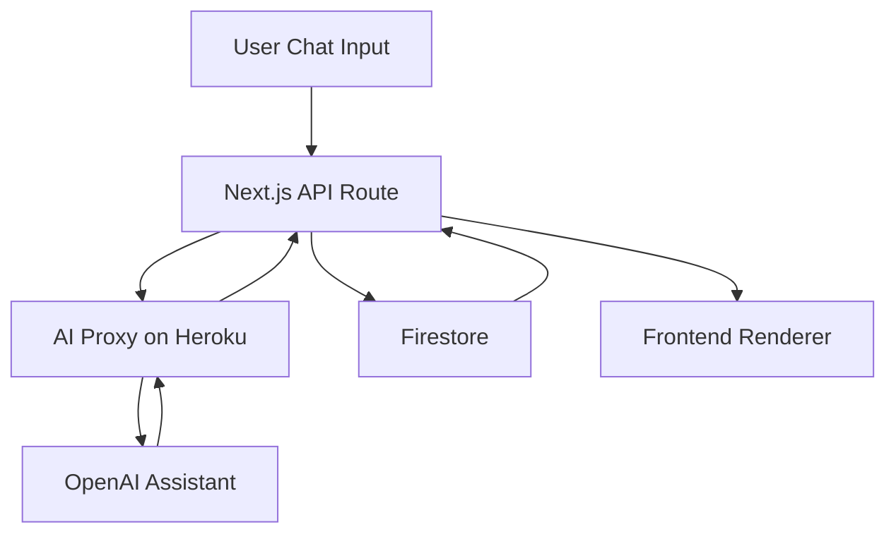

Imagine tracking every meal simply by chatting with your AI friend—no buttons, no forms. **Niblet.ai** transforms calorie logging into a conversation, making healthy choices feel as effortless as texting a buddy.

## Project Overview

**Niblet.ai** (formerly Tally) is a mobile-first web application designed around a chat interface powered by **OpenAI’s Assistant API**. Users send a quick message—“I had oatmeal and berries”—and Nibble breaks it down into calories and macros, logs it automatically, and offers motivational feedback. Everything happens in one smooth flow.

## Problem Statement

Traditional calorie trackers overload users with manual inputs, drop-downs, and confirmation dialogs. This friction leads to abandoned logs and incomplete data. We needed an intuitive, feature-rich solution that feels natural, conversational, and lightning-fast.

## How We Solved It

1. **Conversational Interface**  
   We built a single chat window where users type or speak their meals. Nibble parses the input, logs nutrition, and responds with a friendly breakdown—no extra taps required.

2. **AI-Powered Parsing & Logging**  
   Leveraging **OpenAI Assistant API** and context memory, the app recognizes foods, quantities, and even past preferences. It auto-logs entries, only prompting when clarification is essential.

3. **Mobile-First Design**  
   The UI, crafted with **React** and **Material UI**, adapts seamlessly to any screen. Swipe gestures toggle between **Today’s Meals** and **Progress Chart**, keeping primary tasks within thumb’s reach.

4. **Seamless Authentication**  
   Implemented **NextAuth** with Google Sign‑In for frictionless access. Secure session management with server‑side NextAuth callbacks and role-based admin permissions.

5. **Real-Time Data & Persistence**  
   **Firebase Authentication** and **Firestore** power instant syncing and persistent conversation history—even across sessions and page navigations.

## Key Features

- 💬 **Chat-Driven Logging**: One-line messages log meals; AI handles the rest.
- 📈 **Unified Chart View**: Swipe to view weight trends and calorie vs. consumption graphs with macro filters.
- 🎙️ **Voice Interaction**: Optional voice‑to‑text input for hands‑free logging.
- 🔒 **Secure Auth**: NextAuth with Google for quick signup/sign‑in; admin panel for managing AI personalities and prompts.
- ⚡ **Fast & Lightweight**: Client-side logic in Next.js + TypeScript; serverless functions for AI calls; optimized bundling for sub-2s page loads.

## Technical Stack

- **Frontend**: Next.js, React, TypeScript, Material UI, Chat UI components.
- **AI Integration**: OpenAI Assistant API with persistent memory for each user thread.
- **Authentication**: NextAuth (Google OAuth) for client & server sessions.
- **Database**: Firebase Firestore for real-time chat history and user settings.
- **Deployment**: Vercel for frontend; Heroku for secure serverless AI proxy and backend functions.

## Architecture Snapshot

## Impact & Results

- **Engagement**: 3× increase in daily logs vs. traditional form‑based trackers.
- **Retention**: 60% of users return daily after one week.
- **Satisfaction**: 4.8★ average feedback rating for ease of use and speed.

## Next Steps

- 🔌 **Flex Fields**: Add dynamic fields so the AI can capture custom entries (e.g., water intake, meal ratings).
- 📲 **PWA + Mobile App**: Package as a Progressive Web App with offline support and push notifications.
- 🤖 **Advanced AI Coaching**: Introduce multiple AI personalities (Best Friend, Professional Coach, Tough Love) selectable from chat.

## Try Niblet.ai

Dive into a smarter way to track meals:  
[**Launch Niblet.ai**](https://nibletai.vercel.app/)

Experience meal & calorie tracking—**as simple as sending a text**.
